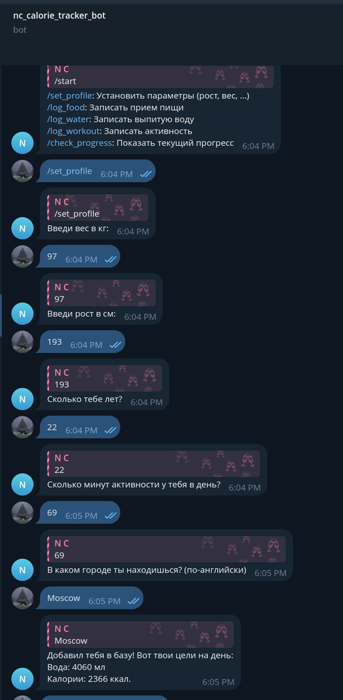
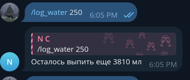
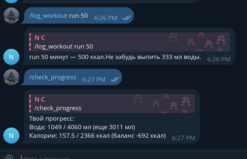
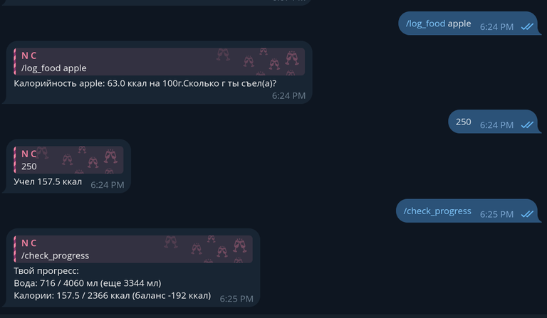
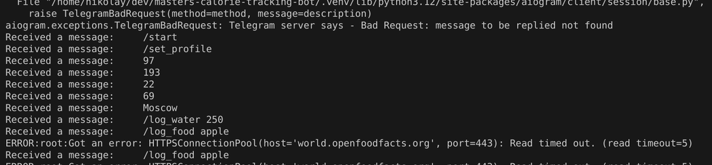
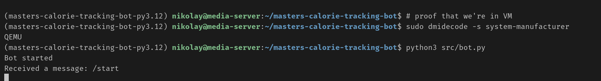

# Calorie tracker bot

## Deploy

1. Clone the repo: `git clone https://github.com/NChechulin/masters-calorie-tracking-bot.git`
2. Ensure `poetry` and compatible python version (^3.10) is installed
3. Run `cd masters-calorie-tracking-bot && poetry install && poetry shell`
4. Add a `.env` file to the root of the project. Example:
```
BOT_TOKEN = "<YOUR BOT TOKEN>"
WEATHER_TOKEN = "<YOUR OPEN WEATHER MAP TOKEN>"
WEATHER_API_BASE = "http://api.openweathermap.org/data/2.5/weather"
FOOD_API_BASE = "https://world.openfoodfacts.org/cgi/search.pl"
```
5. Run the bot: `python3 src/bot.py`

## Demo

### Set profile



### Water



### Workout



### Food & Summary



### Logs



### Deploy



Бота задеплоил на домашнем сервере (не VPS но тоже в виртуалке, пруф на скрине)
